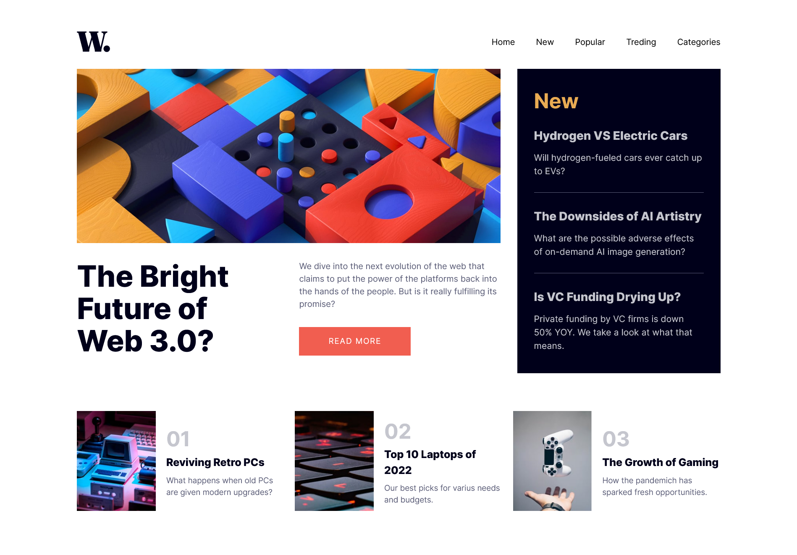
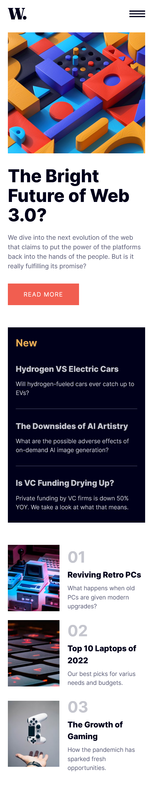

# Frontend Mentor - Solución de página de inicio de noticias

Esta es una solución al [desafío de la página de inicio de noticias en Frontend Mentor] (https://www.frontendmentor.io/challenges/news-homepage-H6SWTa1MFl). Los desafíos de Frontend Mentor lo ayudan a mejorar sus habilidades de codificación mediante la creación de proyectos realistas.

## Tabla de contenido

- [Mentor de Frontend - Solución de página de inicio de noticias](#frontend-mentor---solución de página de inicio de noticias)
   - [Tabla de contenido](#tabla de contenido)
   - [Resumen](#resumen)
     - [El desafío](#el-desafío)
     - [Captura de pantalla](#captura-de-pantalla)
       - [Escritorio](#escritorio)
       - [Móvil](#móvil)
     - [Enlaces](#enlaces)
   - [Mi proceso](#mi-proceso)
     - [Construido con](#construido-con)
   - [Autor](#autor)

## Descripción general

### El reto

Los usuarios deberían poder:

- Ver el diseño óptimo para la interfaz según el tamaño de pantalla de su dispositivo
- Ver estados de desplazamiento y enfoque para todos los elementos interactivos en la página

### Captura de pantalla

#### Escritorio

#### Móvil

### Enlaces

- URL de la solución: [GitHub](https://github.com/jean266/principal-pagina-inicio-noticias)
- URL del sitio en vivo: [Vercel](https://your-live-site-url.com)

## Mi proceso

### Construido con

- Caja flexible
- Cuadrícula CSS
- Vuejs
- Tailwindcss

## Autor

- Mentor de frontend - [@jean266](https://www.frontendmentor.io/profile/jean266)